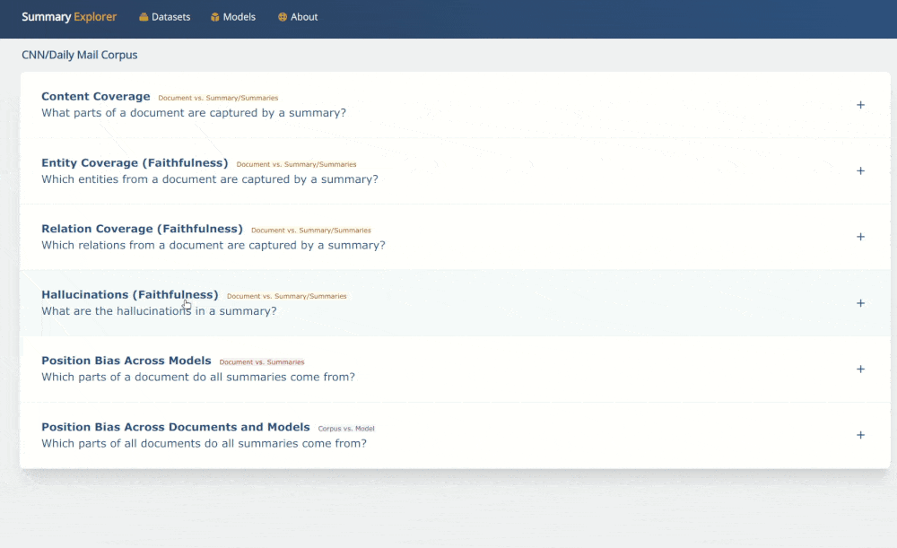
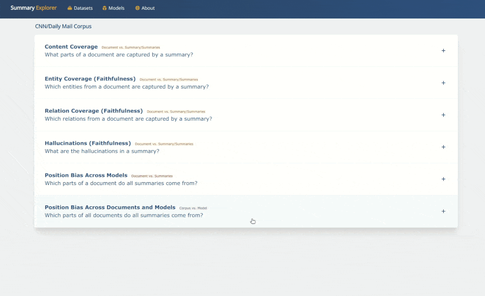

# Summary Explorer

[Summary Explorer](https://tldr.webis.de/) is a tool to visually inspect the summaries from several state-of-the-art neural summarization models across multiple datasets. It provides a guided assessment of summary quality dimensions such as coverage, faithfulness and position bias. You can inspect summaries from a single model or compare multiple models.

The tool currently hosts the outputs of [55 summarization models](https://tldr.webis.de/models) across three datasets: [CNN DailyMail](https://huggingface.co/datasets/cnn_dailymail), [XSum](https://huggingface.co/datasets/xsum), and [Webis TL;DR](https://huggingface.co/datasets/reddit).

To integrate your model in Summary Explorer, please prepare your summaries as described [here](https://tldr.webis.de/about) and contact us.


### Use cases

**1. View Content Coverage of the Summaries**


**2. Inspect Hallucinations**


**3. View Named Entity Coverage of the Summaries** 


**4. Inspect Faithfulness via Relation Alignment**


**5. Compare Agreement among Summaries**


**6. View Position Bias of a Model**

### Local Deployment
Download the database dump from [here](https://files.webis.de/summary-explorer/database/dbexport.sql) and set up the tool as instructed [here](ui/README.md). The text processing pipeline and sample data can be found [here](text-processing/).

**Note**: The tool is in active development and we plan to add new features. Please feel free to report any issues and provide suggestions.

### Citation
```
@misc{syed2021summary,
      title={Summary Explorer: Visualizing the State of the Art in Text Summarization}, 
      author={Shahbaz Syed and Tariq Yousef and Khalid Al-Khatib and Stefan Jänicke and Martin Potthast},
      year={2021},
      eprint={2108.01879},
      archivePrefix={arXiv},
      primaryClass={cs.CL}
}
```


### Acknowledgements
We sincerely thank all the authors who made their code and model outputs publicly available, meta evaluations of [Fabbri et al., 2020](https://github.com/Yale-LILY/SummEval) and [Bhandari et al., 2020](https://github.com/neulab/REALSumm), and the summarization leaderboard at [NLP-Progress](https://nlpprogress.com/english/summarization.html). 

We hope this encourages more authors to share their models and summaries to help track the *qualitative progress* in text summarization research. 
