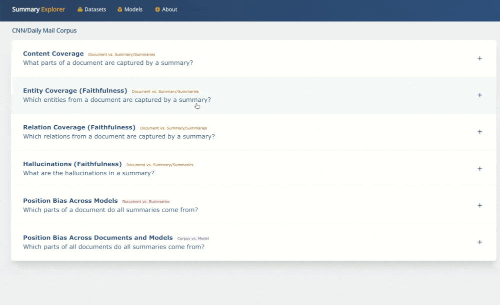

# Summary Explorer
[Summary Explorer](https://tldr.webis.de/) is a tool to visually inspect the summaries from several state-of-the-art neural summarization models across multiple datasets. It provides a guided assessment of summary quality dimensions such as coverage, faithfulness and position bias. You can inspect summaries from a single model or compare multiple models. 

The tool currently hosts the outputs of [55 summarization models](https://tldr.webis.de/models) across three datasets: [CNN DailyMail](https://huggingface.co/datasets/cnn_dailymail), [XSum](https://huggingface.co/datasets/xsum), and [Webis TL;DR](https://huggingface.co/datasets/reddit).

To integrate your model in Summary Explorer, please prepare your summaries as described [here](https://tldr.webis.de/about) and contact us.

>Accepted at EMNLP 2021 (Demo track). A pre-print version of the paper is available [here](https://arxiv.org/abs/2108.01879).

**Update 17.03.2022**
1. Refactored the text processing pipeline.
2. Updated [local deployment instructions](https://github.com/webis-de/summary-explorer/edit/main/README.md#adding-your-own-model-locally) for custom models.


### Use cases

**1. View Content Coverage of the Summaries**


**2. Inspect Hallucinations**


**3. View Named Entity Coverage of the Summaries** 



**4. Inspect Faithfulness via Relation Alignment**


**5. Compare Agreement among Summaries**


**6. View Position Bias of a Model**


### Adding your own model locally

**Text processing**

Apply the 5-step text processing pipeline from the  `text-processing` sub-directory as shown below.

1. Tokenization, sentence segmentation, named entity recognition, relation extraction, flattening redundant relations
   `python3 step_1_nlp_pipeline.py --input_dir ../data/raw_files/ --output_dir ../data/nlp-processed/`

2. Lexical alignment of the summary with the source document using ROUGE
   `python3 step_2_lexical_alignment.py --input_dir ../data/nlp-processed/ --output_dir ../data/lexical-alignments/`

3. Semantic alignment of the summary with the source document using BERTScore
   `python3 step_3_semantic_alignment.py --input_dir ../data/lexical-alignments/ --output_dir ../data/semantic-alignments/`

4. ROUGE scores
   `python3 step_4_automatic_evaluation.py --input_dir ../data/semantic-alignments/ --output_dir ../data/automatic-metrics/`

5. Summary compression, summary factuality (entity and relation level), n-gram abstractiveness
   `python3 step_5_document_overlap_metrics.py --input_dir ../data/automatic-metrics/ --output_dir ../data/document-overlap-metrics/ `

Next, create a `models_details.jsonl` file which contains meta information about your models. For e.g.,

```
{"name": "model_1", "title": "model_1 title", "abstract": "TBD", "human evaluation": "TBD", "url": ""}
{"name": "model_2", "title": "model_2 title", "abstract": "TBD", "human evaluation": "TBD", "url": ""} 
{"name": "references", "title": "References", "abstract": "TBD", "human evaluation": "TBD", "url": ""}
```

Then, create a `config.json` file with all the paths to the processed  articles, summaries and the `models_details.jsonl` files. This file must also contain your dataset description.  For e.g.,

```
{
  "dataset": {
    "name": "Dataset X",
    "description": "DATASET \n N Articles \n M Models"
  },
  "path_to_models_details_file": "models_details.jsonl",
  "path_to_articles_file": "articles.jsonl",
  "path_to_summaries_files": {
    "references": "references.jsonl",
    "model_1": "model_1.jsonl",
    "model_2": "model_2.jsonl"
  }
}
```

**Setting up the Django app and importing to the local database**

In the `ui` sub-directory:

1. Install the dependencies

   `pip install -r requirements.txt`

2. Create a postgres database

   ``````
   psql --username=postgres
   CREATE DATABASE sumviz;
   ``````

3. To import the database dump [file](https://files.webis.de/summary-explorer/database/dbexport.sql) of all the 55 models hosted online
   `psql -h hostname -d sumviz -U username -f dbexport.sql`

4. To import your own models (via the `config.json` file created above), run the `import_dataset` command
   `python manage.py import_dataset -c PATH-TO-config.json`

5. Create a `.env` file with your database settings. For e.g.,

   ``` 
   DEBUG=0
   SECRET_KEY=**********
   DJANGO_ALLOWED_HOSTS=localhost 127.0.0.1 [::1]
   SQL_ENGINE=django.db.backends.postgresql_psycopg2
   SQL_DATABASE=sumviz
   SQL_USER=postgres
   SQL_PASSWORD=****
   SQL_HOST=db
   SQL_PORT=5432
   DATABASE=postgres
   ```

6. Start the server
   `python manage.py runserver`
7. Visit http://127.0.0.1:8000/


**Note**: The tool is in active development and we plan to add new features. Please feel free to report any issues and provide suggestions.

### Citation
```
@inproceedings{syed:2021,
    title = "Summary Explorer: Visualizing the State of the Art in Text Summarization",
    author = {Syed, Shahbaz  and
      Yousef, Tariq  and
      Al Khatib, Khalid  and
      J{\"a}nicke, Stefan  and
      Potthast, Martin},
    booktitle = "Proceedings of the 2021 Conference on Empirical Methods in Natural Language Processing: System Demonstrations",
    year = "2021",
    publisher = "Association for Computational Linguistics",
    url = "https://aclanthology.org/2021.emnlp-demo.22"
}

```


### Acknowledgements
We sincerely thank all the authors who made their code and model outputs publicly available, meta evaluations of [Fabbri et al., 2020](https://github.com/Yale-LILY/SummEval) and [Bhandari et al., 2020](https://github.com/neulab/REALSumm), and the summarization leaderboard at [NLP-Progress](https://nlpprogress.com/english/summarization.html). 

We hope this encourages more authors to share their models and summaries to help track the *qualitative progress* in text summarization research. 
